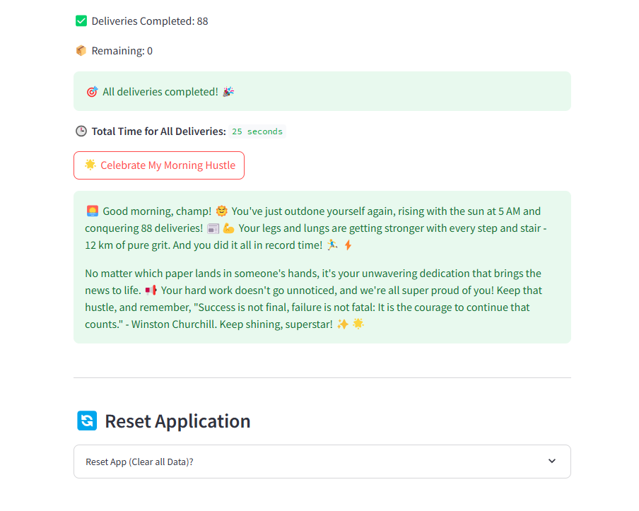

# 🗞️ PaperPilot - Optimized Newspaper Delivery Application

> **Built by a real paperboy, for paperboys.**  
> **Starting your day, the PaperPilot way.**

---

## Overview
Hi, I’m a paperboy delivering newspapers every morning -  
and **PaperPilot** is the tool I built to make my route smarter, faster, and more motivating.  

This is a smart, real-time app built with **Streamlit** to:

- Organize and track newspaper collection
- Optimize delivery routes using **Google OR-Tools**
- Monitor real-time delivery progress and time tracking
- Celebrate your daily hustle with an AI-powered motivational message

---

## Features

-  Newspaper collection checklist
-  Update newspaper counts dynamically
-  Total paper count calculator
-  Optimized delivery route planning (Vehicle Routing Problem - VRP)
-  Real-time delivery timer (Start, Pause, Resume, Finish)
-  House-wise delivery completion tracking
-  Dynamic motivational message generation using Azure AI
-  Full session-state persistence (safe even if the page refreshes)
-  App Reset option for a fresh start

---

## Tools and Models Used

| Category | Name | Purpose |
|:---|:---|:---|
| Framework | **Streamlit** | Build the interactive web app for collection, delivery tracking, and timer |
| Optimization Library | **Google OR-Tools** | Solve the Vehicle Routing Problem (VRP) for optimized newspaper delivery |
| AI Service | **Azure OpenAI Inference** | Connect to AI models for generating motivational summaries |
| AI Model | **Phi-3-small-8k-instruct** (via Azure) | Generate short, energetic motivational messages after delivery |
| Programming Language | **Python** | Core development language |
| Package Manager | **pip** | Manage and install project dependencies |

---

## Installation & Setup

### 1. Clone the Repository
```bash
git clone https://github.com/<your-username>/paperpilot.git
cd paperpilot
```

### 2. Install Dependencies
```bash
pip install -r requirements.txt
```

### 3. Set Azure AI Key (Environment Variable)

- For **Windows CMD**:
  ```bash
  set AZURE_INFERENCE_KEY=your-azure-inference-key-here
  ```

- For **Mac/Linux**:
  ```bash
  export AZURE_INFERENCE_KEY=your-azure-inference-key-here
  ```

>  **Note:** The Azure Inference Key is required to generate the motivational summary.

### 4. Run the App
```bash
streamlit run app.py
```

---
## Project Structure

| File | Description |
|:---|:---|
| `app.py` | Streamlit frontend — user interface for collection, delivery, timer, and summary |
| `newspaper_delivery_agent.py` | Backend engine — optimization logic + Azure AI summary generation |
| `requirements.txt` | Python dependencies list |
| `.gitignore` | Files/folders to ignore during Git operations |

---

## How It Works

- Select and mark newspapers collected
- See the real-time total paper count
- Start the delivery timer and deliver houses
- Mark each house delivered as you complete it
- Finish delivery to see your total time
- Celebrate your morning hustle with a motivational AI message
- Reset app easily for the next day's deliveries

---

## Screenshots & Demo Video

### Dashboard


### Timer Running


### AI Celebration


---

### Live Demo

[Watch Demo](https://drive.google.com/file/d/1yApheYAQ8gPbcOcn34s5O-QpXo0jkSJq/view?usp=sharing)

---


## License

This project is licensed under the **MIT License** — feel free to use and improve it.

---

## Contact

- GitHub: [[Dhanush](https://github.com/dhanushhhh)]

---
